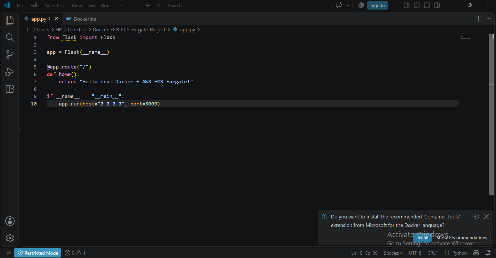
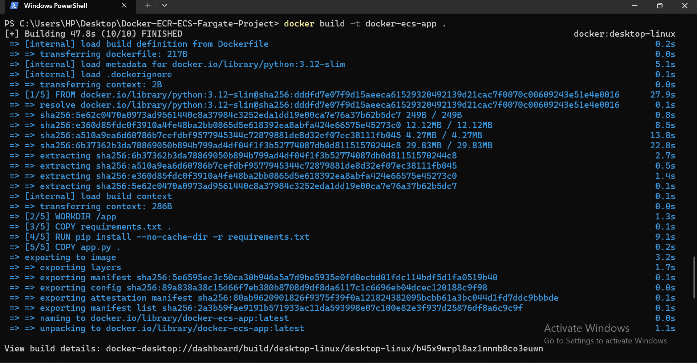
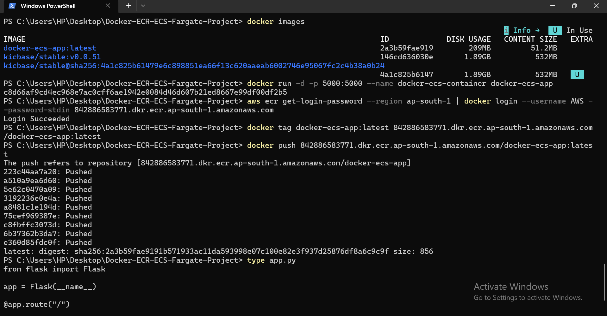
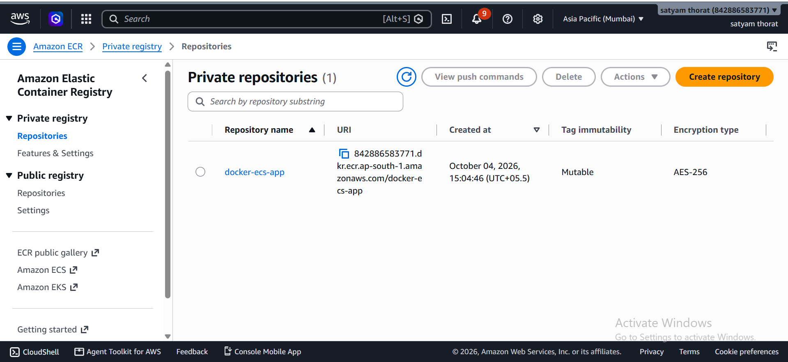
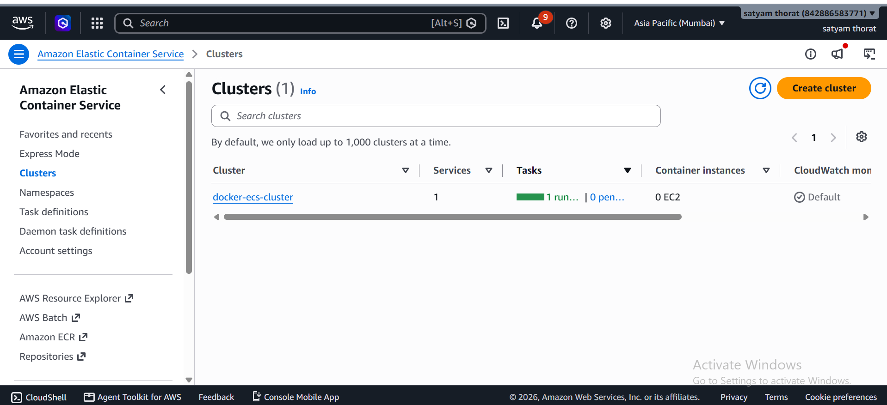
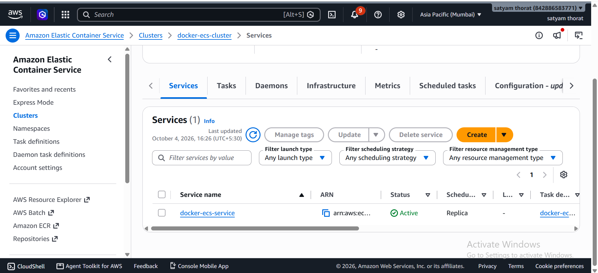
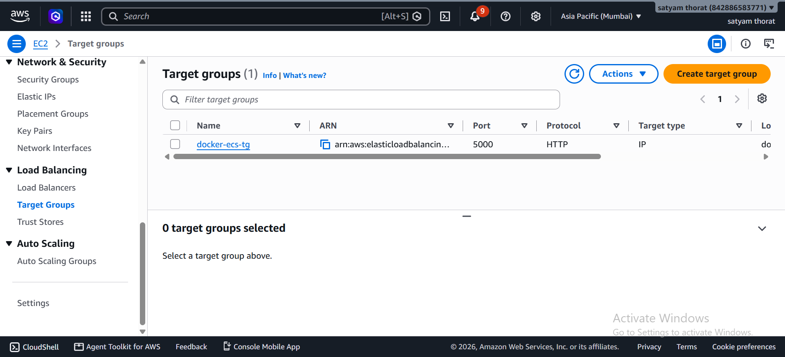
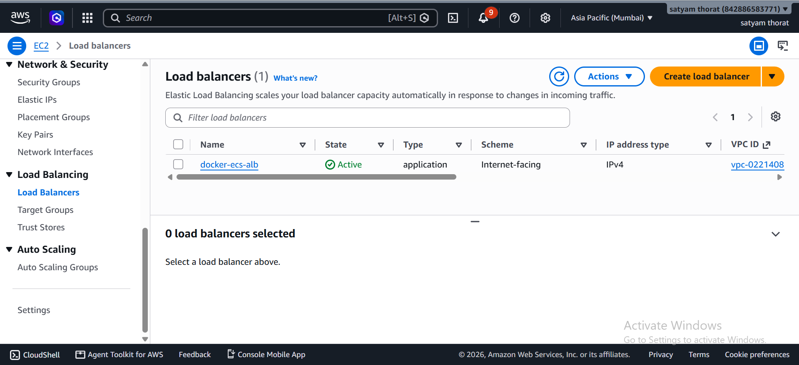
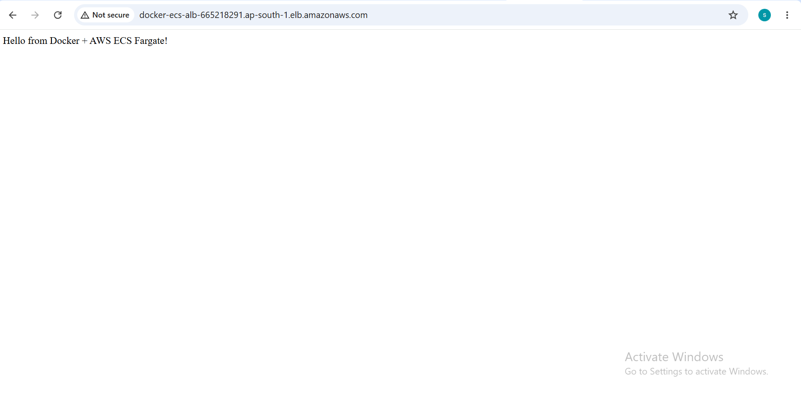

# Docker + Amazon ECR + ECS Fargate Project

This project demonstrates how to containerize a Python Flask application
using Docker and deploy it on AWS ECS Fargate using Amazon ECR and an
Application Load Balancer.

## Project Overview

In this project, I created a simple Python Flask application and
containerized it using Docker.

The Docker image was pushed to Amazon ECR and then deployed on Amazon
ECS Fargate.

An Application Load Balancer was configured to provide access to the
application from the internet.

## Architecture

``` text
Internet
    |
    v
Application Load Balancer
    |
    v
Amazon ECS Fargate
    |
    v
Docker Container
    |
    v
Python Flask Application
```

Amazon ECR is used to store the Docker image.

### Architecture Diagram


## Technologies Used

-   Python
-   Flask
-   Docker
-   Amazon ECR
-   Amazon ECS
-   AWS Fargate
-   Application Load Balancer
-   Amazon CloudWatch
-   Git
-   GitHub

## Project Structure

``` text
Docker-ECR-ECS-Fargate-Project
│
├── app.py
├── Dockerfile
├── requirements.txt
├── README.md
├── architecture-diagram.png
│
└── screenshots
    ├── 01-flask-app.png
    ├── 02-docker-image.png
    ├── 03-docker-container.png
    ├── 04-ecr-image.png
    ├── 05-ecs-cluster.png
    ├── 06-task-definition.png
    ├── 07-ecs-service.png
    ├── 08-target-group.png
    ├── 09-alb.png
    └── 10-live-application.png
```

## 1. Flask Application

I created a simple Flask application using Python.

The application runs on port **5000**.

Application response:

``` text
Hello from Docker + AWS ECS Fargate!
```

## 2. Docker

A Dockerfile was created to containerize the Flask application.

### Build Docker Image

``` bash
docker build -t docker-ecs-app .
```

### Run Docker Container

``` bash
docker run -d -p 5000:5000 --name docker-ecs-container docker-ecs-app
```

### Test Locally

``` text
http://localhost:5000
```

## 3. Amazon ECR

After creating the Docker image, I pushed it to Amazon Elastic Container
Registry (ECR).

ECR Repository:

``` text
docker-ecs-app
```

Docker image:

``` text
docker-ecs-app:latest
```

The image was successfully uploaded to Amazon ECR.

## 4. Amazon ECS Fargate

I created an ECS cluster for running the containerized application.

ECS Cluster:

``` text
docker-ecs-cluster
```

Launch type:

``` text
AWS Fargate
```

## 5. ECS Task Definition

A task definition was created to define how the Docker container should
run.

Task Definition:

``` text
docker-ecs-task
```

Container:

``` text
docker-ecs-container
```

Container Port:

``` text
5000
```

## 6. ECS Service

An ECS service was created to maintain the running application.

Service:

``` text
docker-ecs-service
```

Desired tasks:

``` text
1
```

The ECS service successfully launched the application on AWS Fargate.

## 7. Application Load Balancer

An Application Load Balancer was configured to expose the application to
the internet.

Load Balancer:

``` text
docker-ecs-alb
```

Target Group:

``` text
docker-ecs-tg
```

Target Port:

``` text
5000
```

Health check path:

``` text
/
```

The ALB successfully routed HTTP traffic to the ECS Fargate container.

## Deployment Flow

``` text
Flask Application
       |
       v
Dockerfile
       |
       v
Docker Image
       |
       v
Amazon ECR
       |
       v
ECS Task Definition
       |
       v
ECS Fargate Service
       |
       v
Application Load Balancer
       |
       v
Internet
```

## Screenshots

### Flask Application



### Docker Image



### Docker Container



### Amazon ECR



### ECS Cluster



### ECS Task Definition


### ECS Service



### Target Group



### Application Load Balancer



### Live Application



## What I Learned

-   Creating a Python Flask application
-   Creating a Dockerfile
-   Building Docker images
-   Running applications using Docker containers
-   Pushing Docker images to Amazon ECR
-   Creating an ECS Fargate cluster
-   Creating ECS task definitions
-   Creating ECS services
-   Configuring Application Load Balancer
-   Configuring target groups and health checks
-   Deploying containerized applications on AWS
-   Using Git and GitHub for project management

## Project Result

The Flask application was successfully containerized using Docker and
deployed on AWS ECS Fargate.

The Docker image was stored in Amazon ECR and the application was
accessed through an Application Load Balancer.

Application response:

``` text
Hello from Docker + AWS ECS Fargate!
```

